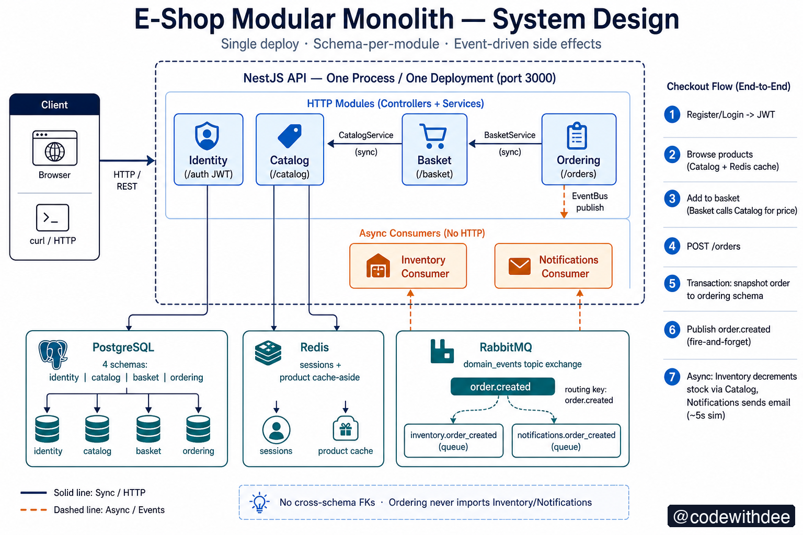
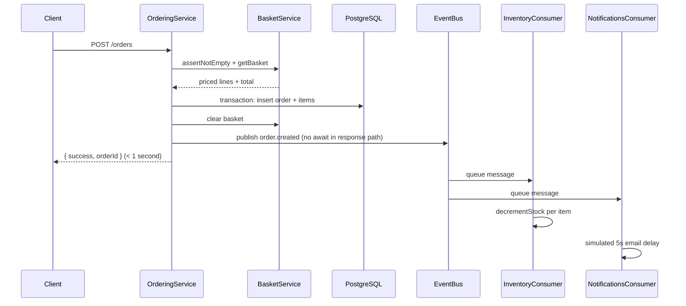

# Architecture: How It Works and Why

This document explains the **runtime behavior** of the E-Shop modular monolith and the **reasoning** behind each major design choice. It is written for someone who wants to understand not just *what* the folders are called, but *why* the system behaves the way it does.

## System design diagram

*Single NestJS deployment, four HTTP modules, two async consumers, Postgres (schema-per-module), Redis, and RabbitMQ fan-out on `order.created`. Diagram by [@codewithdee](https://codewithdee.com).*

---

## What problem this codebase solves

Most "monoliths" fail because they are organized by **technical layer** (`controllers/`, `services/`, `utils/`). Over time, every file can import every other file. Checkout code calls email code calls catalog code in a tangled chain. Changing one feature breaks three others.

This project demonstrates the alternative: a **modular monolith** — still one process, one deploy, one database server — but sliced into business modules with **enforced boundaries**. You get the operational simplicity of a monolith (one transaction manager, one deployment pipeline) without the structural decay.

**Why not microservices here?** For an e-shop at this scale, splitting into separate services would add network latency, distributed transactions, and operational overhead before there is a team or traffic problem. The modular monolith keeps the door open: Inventory and Notifications are already written as if they were separate services (queue consumers with no HTTP surface). Extracting them later is a deployment change, not a rewrite.

---

## How a request enters the system

1. HTTP hits a single NestJS app (`main.ts`).
2. A global `ValidationPipe` strips unknown fields and validates DTOs — **why:** reject bad input at the edge before it reaches business logic.
3. The request is routed to one module's controller (`IdentityController`, `BasketController`, etc.).
4. Protected routes pass through `JwtAuthGuard`, which validates the Bearer token and attaches the user to the request.
5. The controller delegates to its module's service. The service may call **exported services** from other modules (sync) or **publish events** (async).
6. The response returns. Side effects that are slow or optional happen **after** the HTTP response path, via RabbitMQ consumers in the same process.

There is no API gateway, no service mesh, no inter-service HTTP. Everything in-process except calls to Postgres, Redis, and RabbitMQ.

---

## The checkout story (end-to-end)

This is the central demo flow. Understanding it explains most of the architecture.

### Step 1 — Customer adds items to basket

`POST /basket/items` stores `{ userId, productId, quantity }` in `basket.cart_items`.

**How:** Basket does not store product names or prices. It only stores IDs and quantities.

**Why:** Catalog owns product data. If Basket duplicated names/prices in its table, they would go stale when an admin changes a price. Instead, every `GET /basket` re-fetches live prices via `CatalogService.getProductForOrder()`. The cart is a list of *intent*; Catalog is the source of truth for *what those items cost right now*.

### Step 2 — Customer places order

`POST /orders` triggers `OrderingService.placeOrder()`.

**How (in order):**

1. Load basket via `BasketService.assertNotEmpty()` — fails fast if empty.
2. Open a **single database transaction** and insert into `ordering.orders` + `ordering.order_items`.
3. **Snapshot** product name, unit price, and line total onto each order line — these values are frozen at checkout time.
4. Commit the transaction.
5. Clear the basket.
6. Publish `order.created` to RabbitMQ (fire-and-forget).
7. Return `{ success: true, orderId }` to the client.

**Why snapshot prices on the order?** Unlike the basket (which shows live prices), an order is a legal/commercial record. If a product price changes tomorrow, yesterday's order must still show what the customer actually paid. That's why Ordering copies `productName`, `unitPrice`, and `lineTotal` into `order_items` at commit time.

**Why publish *after* commit?** If you published the event inside the transaction and then the transaction rolled back, Inventory might decrement stock for an order that never existed. Publishing after commit means: "if the event exists, the order definitely exists in Postgres."

**Why fire-and-forget?** The customer should not wait for email delivery or stock updates. Those take seconds (email is simulated at 5s). The HTTP response returns as soon as the order is durable in Postgres and the event is handed to RabbitMQ.

### Step 3 — RabbitMQ fans out the event

One `order.created` message is copied to two independent queues:

- `inventory.order_created` → reduces stock
- `notifications.order_created` → sends (simulated) receipt email

**Why a topic exchange + separate queues?** Ordering publishes once. Each consumer has its own queue and processes at its own speed. If email is slow, inventory still runs immediately. If you add an Analytics consumer tomorrow, you bind a new queue — Ordering code does not change.

### Step 4 — Consumers react independently

**Inventory** calls `CatalogService.decrementStock()` for each line item, then invalidates the Redis product cache.

**Notifications** waits 5 seconds (simulating an external email API) and logs success.

**Why doesn't Ordering import these modules?** Because that would recreate the bad monolith chain: `placeOrder()` → `sendEmail()` → `decrementStock()` → customer waits for all of it. Events invert the dependency: Ordering announces "an order happened"; other modules decide if they care.

---

## How module boundaries are enforced

Boundaries are not just documented — they are **structurally difficult to violate**.

### 1. Schema-per-module in PostgreSQL

Each module has its own schema: `identity`, `catalog`, `basket`, `ordering`.

**Why one database but multiple schemas?** Separate databases per module would require distributed transactions for checkout (basket + order in one atomic step). One database keeps ACID transactions simple while schemas still signal ownership. No module has a foreign key into another module's tables — so you cannot accidentally `JOIN catalog.products` from a Basket query without explicitly crossing a boundary.

### 2. Narrow exports from Nest modules

`CatalogModule` exports only `CatalogService`. The `Product` repository is private.

**Why?** If Basket could inject `Repository<Product>`, it could query or mutate catalog tables directly, bypassing cache invalidation and business rules in `CatalogService`. Exporting one service forces all catalog access through a reviewed API.

### 3. Logical references, not foreign keys

`basket.cart_items.product_id` is a UUID with **no FK** to `catalog.products`.

**Why?** A database FK would couple Basket migrations to Catalog's table lifecycle. More importantly, it encodes "these modules are one blob" at the persistence layer. The application enforces validity by calling `getProductForOrder()` — if the product doesn't exist, add-to-basket fails with a proper error.

### 4. Event payloads are self-contained

`OrderCreatedEvent` includes `productName`, `unitPrice`, and `quantity` for every line.

**Why?** Notifications can send a receipt without calling back into Ordering or Catalog. Inventory can decrement stock without loading the order from Postgres. Consumers should be able to act on the event alone — this is what makes them extractable to separate services later.

---

## How authentication works

1. Register/login hashes the password with bcrypt and issues a JWT signed with `JWT_SECRET`.
2. The same flow writes `session:{userId}` to Redis (7-day TTL).
3. Protected routes require `Authorization: Bearer <token>`.
4. `JwtStrategy` validates the signature and expiry; `JwtAuthGuard` rejects invalid tokens before the controller runs.

**Why JWT + Redis session?** JWT alone is stateless — you cannot revoke it without a blocklist. The Redis session record is a hook for future revocation ("log out everywhere") without querying Postgres on every request. For this demo, the guard validates JWT only; the session write demonstrates where revocation data would live.

**Why not store sessions only in Postgres?** Session reads on every authenticated request would add DB load. Redis is the right tier for ephemeral, high-read data.

---

## How caching works (Catalog)

`GET /catalog/products/:id` uses **cache-aside**:

1. Check Redis key `catalog:product:{id}`.
2. On miss → read Postgres → write Redis with 300s TTL → return.
3. On stock decrement (Inventory consumer) → delete the cache key.

**Why cache-aside, not write-through?** Product reads are much hotter than writes. Cache-aside keeps the read path fast without complicating every write path. Invalidation on stock change prevents serving stale stock counts.

**Why not cache the product list endpoint?** The list changes less predictably (new products, admin edits). This demo caches the hot single-product read path only — the pattern is the lesson, not exhaustive caching policy.

---

## What Inventory and Notifications prove

These modules have **no HTTP controllers**. They are not "lesser" modules — they represent how side-effect work *should* be structured:

| Concern | Sync (bad for slow work) | Async (this repo) |
|---------|--------------------------|-------------------|
| Stock update | Block `POST /orders` until stock decremented | Inventory consumer runs after response |
| Email receipt | Block `POST /orders` for 5+ seconds | Notifications consumer runs in background |

Run `POST /orders` and watch the logs: the HTTP response returns **before** the "Sending receipt email..." line appears, and the email line finishes ~5 seconds later. That timing gap is the entire point.

---

## Sequence diagram: place order

---

## Further reading

Each module and infrastructure folder has its own README with deeper "how + why" for that area:

- [Modules index](../src/modules/README.md)
- [Infrastructure index](../src/infrastructure/README.md)
- [Source tree](../src/README.md)
